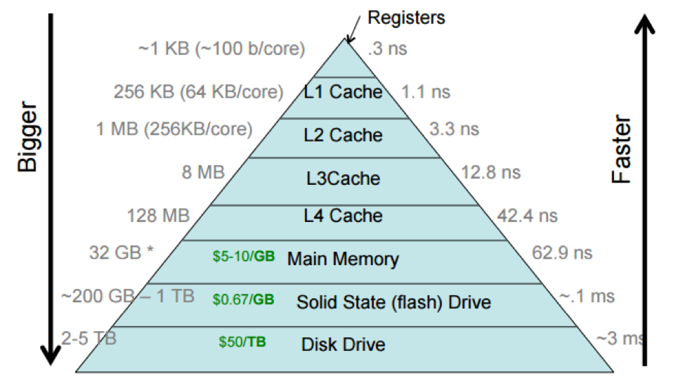
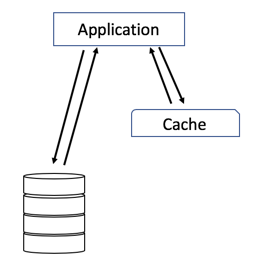

****# 캐싱과 캐싱전략

이전부터 캐싱 전략에 대해 정리해야겠다고 마음 먹고 있었는데 오늘에서야 정리하게 되었다.  캐싱이 무엇인지부터 짚고 그다음에 정리해야겠다.

# 캐시란 무엇일까?

- 단순하게는 저장한다는 뜻을 가지고 있다.
- 요청될 데이터를 더 빠르게 전달하기 위해 데이터를 저장하는 하드웨어 또는 소프트웨어 컴포넌트
- 지역성을 이용해 데이터 접근 속도를 향상시킬 수 있는 메모리 구조(or 계층)로 볼 수 있다.
- 효율성을 따진다면 [파레토의 법칙](https://en.wikipedia.org/wiki/Pareto_principle)을 떠올리자.

## 캐시 관련 용어들

### Cache-hit과 Cache-miss

- Cache hit은 캐시에서 요청받은 데이터를 찾을 수 있을때 발생한다.
- Cache miss는 그럴 수 없을 경우 발생한다.

### TTL (Time To Live)

- 캐시의 만료기간

### CPU Cache

- 상위 레이어로 갈수록 속도는 빨라지면서 용량은 작아진다.  캐싱에 자주 사용되는 Redis는 Memory 층에 있다.
- SSD를 사용해도 Main memory에서 읽어오는 속도가 훨씬 빠르다.


[https://cs.brown.edu/courses/csci1310/2020/assign/labs/lab4.html](https://cs.brown.edu/courses/csci1310/2020/assign/labs/lab4.html)

<br><br>

## 지역성(Locality)에 관하여

```
캐시 적중율(Hit-rate)을 올리기 위해 캐싱할 데이터는 지역성을 띄어야한다.
지역성은 데이터 액세스가 시공간 또는 (실행)순차적으로 가깝거나 비슷하게 발생하는 것을 뜻한다.
```

<br>

### 시간적 지역성(Temporal Locality)

- 특정 데이터에 한번 접근했다가 가까운 미래에 같은 데이터에 접근할 가능성이 높음을 의미한다.

<br>

### 공간적 지역성(Spatial Locality)

- 특정 데이터에 가까운 주소에 순서대로 접근할 가능성이 높음을 의미한다.
- CPU 캐시나 Disk 캐시라면 해당 메모리 주소뿐만 아니라 블록 전체를 캐싱함으로써 공간 지역성의 효율을 높인다.
- 오름차순이나 내림차순으로 접근할 수 있다.
  - 이미 캐싱된 블록의 데이터에 접근하므로 캐시의 효율성이 향상된다.

<br><br><br>

# **그럼 캐싱 전략에는 어떤 것들이 있을까?**

<br>

## Cache-Aside

- 캐시가 애플리케이션 옆에 위치한다.



- 캐시를 옆에 두고 필요한 경우에만 데이터를 캐시에 로드한다.
- Cache-miss 가 발생한 경우
  - 없다는 것을 확인 후 데이터베이스를 조회하고 클라이언트에게 전달한다.
  - 조회한 데이터는 애플리케이션이 캐시 저장소에 저장한다.
- Cache-hit 가 발생한 경우
  - 클라이언트에게 데이터를 전달한다.
- 장점
  - 읽기가 많은 경우에 적합하다.
  - 인-메모리 데이터베이스 Redis 에서 가장 많이 쓰이고 캐시 분리를 사용하여 캐시 오류에 탄력적으로 대응한다.  캐시 클러스터가 다운되어도 시스템 전체에 영향 끼치지 않는다.
  - 캐시를 분리하였기 때문에 데이터베이스의 모델과 다를 수 있다.
- 단점
  - 캐싱되지 않은 경우 요청 처리에 시간이 더 오래 걸릴 수 있다.
  - 캐싱된 데이터가 최신 데이터인지 동기화 문제가 발생한다.

<br>

## Read-Through

- 애플리케이션, 캐시, 데이터베이스가 일렬로 배치된다.


- Cache-miss 가 발생한 경우
  - 데이터베이스에서 누락된 데이터를 로드하고 캐싱 후 데이터를 애플리케이션에 반환한다.
- Cache-Aside와의 차이점
  - 애플리케이션이 캐싱 역할을 하는지에 차이가 있다.
- 장점
  - 읽기가 많은 경우에 적합하다.
- 단점
  - 데이터베이스의 모델과 같아야만 한다. 데이터 처음 요청 시 항상 Cache-miss 가 발생한다.

<br>

## Write-Through

- 데이터를 추가/수정 작업 시 캐시에 동시에 업데이트한다.


- 읽기 작업 시 캐시만 조회하면 된다.
- 장점
  - 항상 동기화 상태이다.
- 단점
  - 지역성이 낮은 데이터도 캐싱되기 때문에 리소스가 낭비된다.
  - 쓰기 지연 시간이 증가한다.
- Write-Through 와 Read-Through 함께 사용하여 장단점을 보완할 수 있다.

<br>

## Write-Back(Write-Behind)

- 데이터를 캐시에 먼저 로드한 후 일정 기간 또는 일정 크기가 됐을 때 캐시에 쌓인 데이터를 데이터베이스에 저장하고 캐싱되어있던 데이터를 삭제한다.


- 장점
  - 쓰기가 많은 워크로드에 적합하다.
  - Read-Through 와 함께 사용하는 혼합 워크로드에 활용하기 적합하다.
  - 쓰기에 대한 비용을 감소시킬 수 있다.
- 단점
  - Cache-Aside 와 Write-Back 모두 사용하는 Redis에서 오류 발생 시 데이터를 영구 소실할 수 있다.

<br>

## Refresh-Ahead

- 캐시가 만료되기 전에 주요 캐시들을 자동으로 새로고침한다.
- 장점
  - 가까운 미래에 어떤 데이터가 필요한지 정확히 예측이 된다면 속도를 크게 향상 시키는 효과를 얻을 수 있다.
- 단점
  - 어떤 데이터가 필요한지 정확히 예측하지 못한다면 사용하지 않을 때보다 성능이 더 저하될 수 있다.

<br><br>
