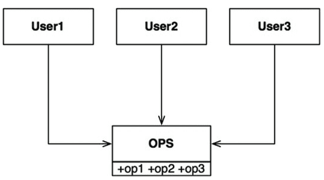

```

```

# Interface(ISP) vs Inheritance(LSP)

# 인터페이스 분리 원칙 : ISP

- “**클라이언트는 자신이 사용하는 메소드에만 의존해야 한다”를 의미한다.**
- 인터페이스 분리가 안된 예시

  - 아래의 상황에서 op1에서 변경사항이 생긴다면, op2와 op3도 영향을 받게 되어 재컴파일 해야하는 상황이 발생한다.

    
- 인터페이스 분리가 이뤄진 예시

  - OPS를 상속받는 U1Ops, U2Ops, U3Ops로 분리한 후, 적합한 클라이언트가 각각의 메소드를 사용할 수 있도록 바꾸면 된다.

    

## 결론

- 인터페이스 분리 원칙은 클라이언트를 기준으로 인터페이스를 분리함으로써, 클라이언트로부터 발생하는 인터페이스의 여파가 다른 클라이언트에 미치는 영향을 최소화하는 것을 목표로 한다.

# 리스코프 치환 원칙 : LSP

- “상위 클래스와 하위 클래스가 상속 관계를 이루고 있을 때 필요한 프로그램의 속성 변경없이 상위 타입을 하위 타입으로 변환할 수 있어야 한다.”를 의미한다.
- 너무나 익숙한 예시

  

# 명시적 형변환(Casting) vs 암묵적 형변환(Promotion)

# 명시적 형변환(Casting)

- 큰 타입에서 작은 타입으로의 변환
- 명시적으로 타입 변환을 작성한다.
- 익숙한 코드 예시

```java
int i = 100;
byte b = (byte) i;
```

- Casting 또는 DownCasting 으로 이해하면 편하다.

# 암묵적 형변환(Promotion)

- 작은 타입에서 큰 타입으로의 변환
- 프로그램 실행 도중 자동으로 일어난다.
- Promotion 또는 UpCasting 으로 이해하면 편하다.

# Interface는 왜 형용사로 작성할까?

- 인터페이스의 목적을 생각해보자.

  - 일반적으로 유형이 아닌 동작, 동작, 기능, 속성 등을 모델링한다.

    → 클래스(타입, 분류)와 생성 목적이 다르다.
- 인터페이스의 사용처를 생각해보자.

  - 인터페이스를 구현해야하는 몇 가지 다른 유형의 사용자가있는 경우가 있다.
    - 인터페이스는 계약이다.
    - 인터페이스는 빈 쉘이다.
    - 인터페이스는 패턴이다.

## (번외) 상속(추상 클래스)에 대해 생각해보자.

- 인터페이스와 유사하지만 상대적으로 더 구체적이다.
- 추상 클래스는 동작에 대해 정의할 수 있다.
- 마치 “*이 클래스는 이렇게 생겼어야 하고, 공통점이 있으니 빈칸을 채워라!*”라는 선언문같다.


```
이 페이지는 '스프링 입문을 위한 자바 객체 지향의 원리와 이해'를 읽고 메모하기 위해 작성한 내용이 포함되어 있습니다.
```
