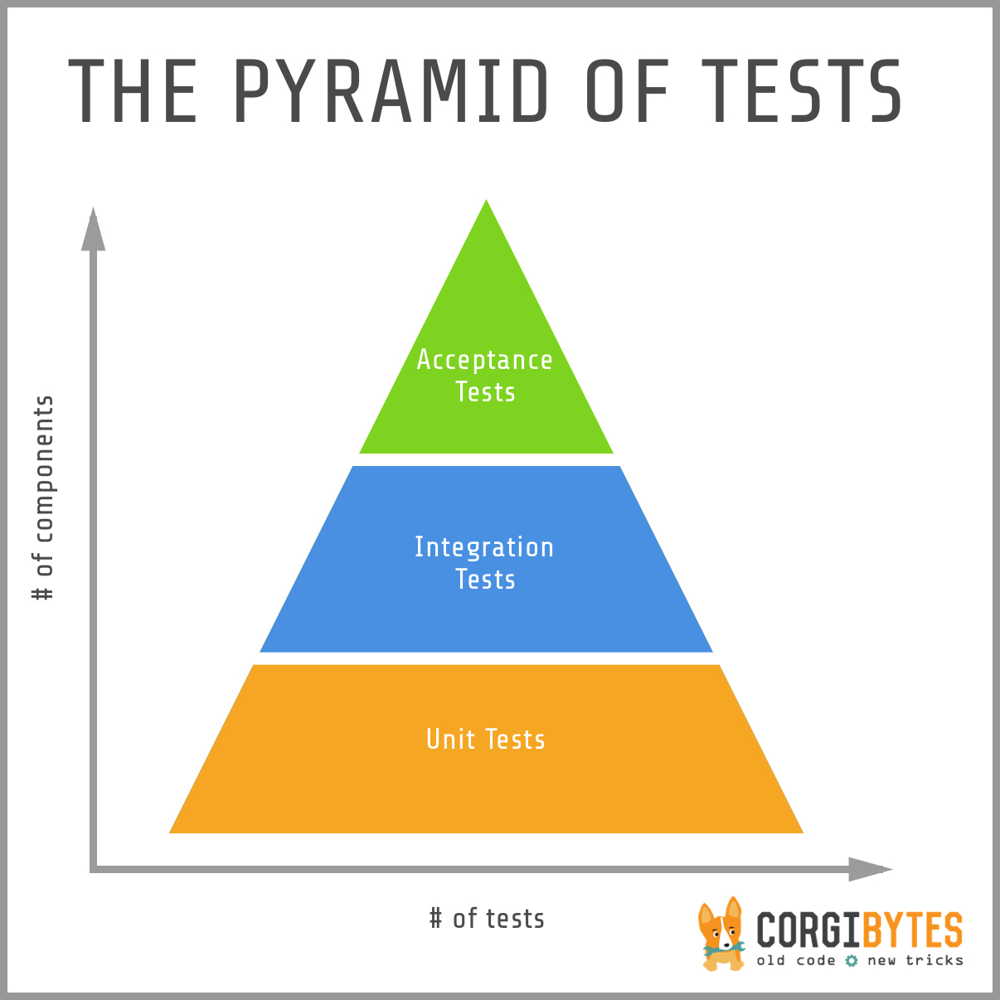

# 테스트 종류에 대해 슬쩍 알아보기

 

## 👀️유닛 테스트(Unit Test)

- 가장 작은 단위의 테스트
- 보통 메서드 단위를 테스트한다.
- 결과를 바로 확인할 수 있다.
- 테스트하기 어려운 부분은 stub을 사용하여 테스트한다.
  - 비용이 크지 않다면 실제 객체를 사용하는 것이 좋다.
  - mock 객체 보다는 실제 객체가 정교하다.
  - 비용 관점에서 고민하고 판단한다.
- 하나의 메서드가 잘 동작함을 확인할 수 있지만 결합되었을 때 올바르게 동작하는지 여부는 확인할 수 없다.

 

## 👀️ 전 구간 테스트(End-To-End Test)

- 전체 시스템을 처음부터 끝까지 테스트하여 잘 동작하는지 확인한다.
- 전 구간 테스트를 통해 문제 영역에 대해 파악하게 되면 서비스를 분할하거나 병합하는 단계로 발전할 가능성이 있다.
- 테스트 범위가 넓어 실패할 가능성이 매우 높댜.
- 테스트 작성이 어렵고, 작성된 테스트도 신뢰도가 낮을 수 있다.

 

## 👀️ 통합 테스트(Integration Test)

- 기본적으로 여러 다른 시스템간 상호작용이 잘 이루어지는지 테스트하는 것을 의미한다.
- 모듈을 통합하는 단계에서 수행한다.
- 단위테스트를 선행한다.
- 단위테스트를 마치면 모듈을 통합하여 통합 테스트를 수행한다.
- 단위테스트에서 발견하지 못한 버그를 확인할 수 있다.

 

## 👀️ 인수 테스트(Acceptance Test)

- 단위 테스트, 통합 테스트와 범위가 다르다.
- 비즈니스 중심으로 테스트한다.
- 구현하고자 하는 기능(비즈니스 레벨)에 초점을 둔 테스트이다.
- 전 구간 테스트를 사용하여 기능을 테스트하여 동일하게 불리기도 한다.
- 사용자 시나리오에 기반하여 수행하는 테스트라고 생각하자.
- 비즈니스 로직은 API를 통해 드러나기 때문에 인수 테스트는 주로 API 확인 테스트로 이뤄진다.
- 인수 테스트는 애플리케이션이 요구사항(인수 조건)대로 잘 동작하는지 테스트하기 위함이다.

 

## 참고 이미지

출처: [https://corgibytes.com/blog/2016/03/28/pyramid-of-tests/](https://corgibytes.com/blog/2016/03/28/pyramid-of-tests/)

**→ 테스트 케이스의 개수를 기준으로 나타냈을 때 유닛 테스트가 가장 넓게 하층부를 차지한다.**

: 유닛 테스트 > 통합 테스트 >  인수 테스트

**→ 코드 범위 기준으로 나타냈을 때는 역순이다.**

: 인수 테스트 > 통합 테스트 >  유닛 테스트
